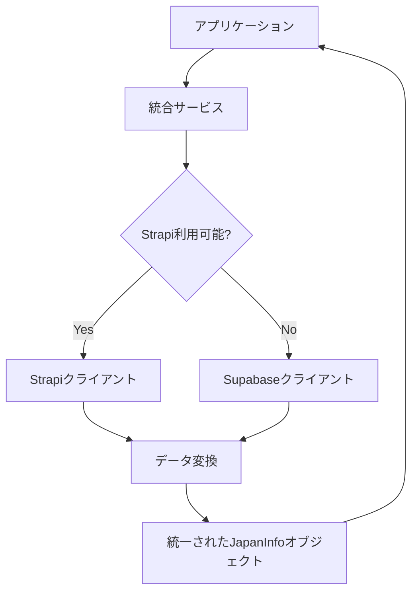

# Lib Directory Architecture

このディレクトリは、IRUTOMOアプリケーションのバックエンドサービスとユーティリティを管理しています。リファクタリングにより、責任の分離とメンテナンス性の向上を実現しています。

## ディレクトリ構造

```
lib/
├── clients/          # 外部サービス接続クライアント
├── config/           # 環境設定とバリデーション
├── services/         # 統合サービスレイヤー
├── transformers/     # データ変換ロジック
├── utils/            # 共通ユーティリティ
└── strapi/           # Strapiクライアント（従来APIのエクスポート）
```

## アーキテクチャの概要

### 1. 設定管理 (`config/`)

**environment.ts**: 環境変数の管理と設定バリデーション
- 環境設定の一元管理
- StrapiとSupabaseの設定バリデーション
- デバッグ設定の制御

```typescript
import { getEnvironmentConfig, validateStrapiConfig } from '@/lib/config/environment';
```

### 2. ログ管理 (`utils/`)

**logger.ts**: 構造化ログシステム
- 開発環境でのデバッグログ制御
- コンポーネント/機能ベースのログ分類
- エラー、警告、情報レベルのログサポート

```typescript
import { logger } from '@/lib/utils/logger';

logger.debug('データ取得開始', {
  component: 'JapanInfoService',
  function: 'getAllArticles'
});
```

### 3. データ変換 (`transformers/`)

**japan-info.ts**: データ変換ロジック
- StrapiレスポンスからJapanInfoオブジェクトへの変換
- SupabaseレスポンスからJapanInfoオブジェクトへの変換
- 統一されたデータ形式の保証

```typescript
import { JapanInfoTransformer } from '@/lib/transformers/japan-info';

const article = JapanInfoTransformer.fromStrapi(strapiData);
```

### 4. クライアント (`clients/`)

#### **strapi.ts**: Strapi v5専用クライアント
- Strapi APIとの直接通信
- 認証、ページネーション、検索機能
- エラーハンドリングとログ

#### **supabase.ts**: Supabaseフォールバッククライアント
- Strapiが利用できない場合のフォールバック
- 同等の機能を提供
- データベース直接アクセス

```typescript
import { StrapiClient } from '@/lib/clients/strapi';
import { SupabaseClient } from '@/lib/clients/supabase';

const strapiClient = new StrapiClient();
const articles = await strapiClient.getAllArticles();
```

### 5. 統合サービス (`services/`)

**japan-info.ts**: Japan Info統合サービス
- StrapiとSupabaseの自動フォールバック
- 統一されたAPIインターフェース
- 従来の関数名との互換性維持

```typescript
import { japanInfoService } from '@/lib/services/japan-info';

// クラスベースAPI
const articles = await japanInfoService.getAllArticles();

// 関数ベースAPI（従来互換）
import { getAllJapanInfoArticles } from '@/lib/services/japan-info';
const articles = await getAllJapanInfoArticles();
```

## データフロー



## 使用方法

### 基本的な使用

```typescript
// 推奨: 統合サービスを使用
import { japanInfoService } from '@/lib/services/japan-info';

const articles = await japanInfoService.getAllArticles({
  page: 1,
  pageSize: 12
});

const article = await japanInfoService.getArticleById('123');
```

### 従来の関数ベースAPI

```typescript
// 既存コードとの互換性維持
import { 
  getAllJapanInfoArticles,
  getJapanInfoArticleById,
  searchJapanInfoArticles 
} from '@/lib/services/japan-info';

const articles = await getAllJapanInfoArticles();
const article = await getJapanInfoArticleById('123');
```

### 個別クライアントの直接使用

```typescript
// 特定のクライアントが必要な場合
import { StrapiClient } from '@/lib/clients/strapi';

const strapiClient = new StrapiClient();
const connectionStatus = await strapiClient.checkConnection();
```

## 主な改善点

### 🏗️ アーキテクチャ
- **責任の分離**: 設定、ログ、変換、通信を個別のモジュールに分離
- **モジュラー設計**: 機能ごとに独立したファイル構成
- **依存関係の明確化**: 各モジュール間の依存関係を明確に定義

### 🔧 保守性
- **単一責任原則**: 各ファイルが特定の責任のみを持つ
- **テストの容易さ**: 機能ごとの独立したテストが可能
- **デバッグの簡単さ**: 構造化ログによる詳細な追跡

### 🚀 パフォーマンス
- **シングルトンサービス**: サービスインスタンスの再利用
- **自動フォールバック**: Strapiダウン時の自動切り替え
- **効率的なエラーハンドリング**: 共通エラー処理ロジック

### 🔄 互換性
- **既存APIの維持**: 既存の関数名とシグネチャを保持
- **段階的移行**: 新旧APIの並行サポート
- **ゼロダウンタイム**: 既存コードへの影響なし

## マイグレーション

従来の`lib/strapi/client.ts`を使用していたコードは、以下のように更新してください：

```typescript
// 旧
import { getAllJapanInfoArticles } from '@/lib/strapi/client';

// 新（推奨）
import { getAllJapanInfoArticles } from '@/lib/services/japan-info';

// または
import { japanInfoService } from '@/lib/services/japan-info';
const articles = await japanInfoService.getAllArticles();
```

## デバッグ

開発環境でのデバッグログを有効にするには：

```bash
# .env.local
NEXT_PUBLIC_DEBUG_MODE=true
```

## 注意事項

- 本番環境ではデバッグログは自動的に無効化されます
- Supabaseフォールバックは警告ログと共に動作します
- 元の`client.ts`は`client.legacy.ts`としてバックアップされています 